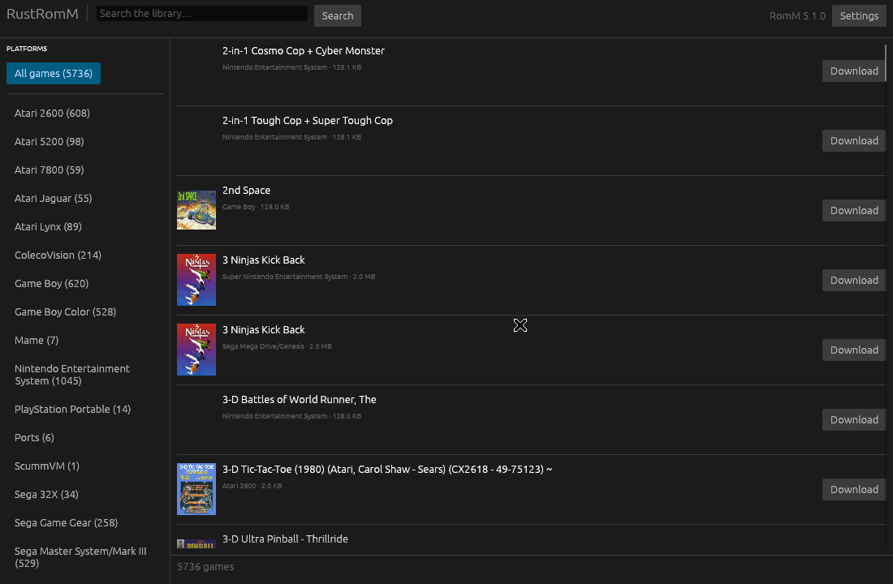

# RustRomM

A cross-platform desktop client for [RomM](https://github.com/rommapp/romm). Browse your
library, download games, and launch them in the emulator you already use — on Linux, macOS
and Windows.

> **Unofficial.** Not affiliated with or endorsed by the RomM project.



---

## Why

RomM's built-in browser player (EmulatorJS) works, but gamepad support in the browser is
janky — input lag, dropped buttons, remapping that doesn't stick. The Android client,
[Argosy](https://github.com/rommapp/argosy-launcher), is seamless by comparison because it
plays natively.

RustRomM takes the same approach on the desktop: it is a **launcher, not an emulator**. It
finds your games, downloads them, and hands the file to RetroArch, PPSSPP, Dolphin or
whatever you prefer. Controller support is then whatever your emulator already does — which
is to say, properly.

## What it does

- Connect to any RomM server with your normal username and password
- Browse the whole library or filter by platform, with cover art
- Search across your collection
- Download games, with progress, cancellation, and no half-written files left behind
- Launch straight into your emulator, configurable per platform
- **Drive the whole thing from a controller** — never touch the mouse
- Remembers your server; optionally remembers your password

### What it doesn't do (yet)

- Emulate anything itself — by design, see above
- Save/state sync back to RomM
- Collections, achievements, multiplayer

## Install

Download a build for your platform from
[Releases](https://github.com/cloudmaking/rustromm/releases). Both x86_64 and arm64 are
built for all three operating systems:

| | x86_64 | arm64 |
|---|---|---|
| Linux | `rustromm-linux-x86_64.tar.gz` | `rustromm-linux-arm64.tar.gz` |
| macOS | `rustromm-macos-x86_64.tar.gz` (Intel) | `rustromm-macos-arm64.tar.gz` (M-series) |
| Windows | `rustromm-windows-x86_64.zip` | `rustromm-windows-arm64.zip` |

Every build except Intel macOS is compiled *and* runs the test suite on a runner of its own
architecture — including both arm64 targets. The Intel macOS binary is cross-compiled from
an Apple Silicon runner, since GitHub is retiring its Intel macOS image, so it is the one
build not covered by a test run.

> ### ⚠️ Your OS will block the first launch — this is expected
>
> These builds aren't signed, so macOS and Windows refuse to run them until you allow it.
> Nothing is wrong; nobody has paid Apple or Microsoft to vouch for the binary.

**macOS** — you'll see *"Apple could not verify 'rustromm' is free of malware."*

1. Extract the archive and try to run it once. It gets blocked.
2. Open **System Settings → Privacy & Security**.
3. Scroll to the message about `rustromm` and click **Open Anyway**.
4. Confirm. It starts, and won't ask again.

Ignore any advice to right-click and choose Open — Apple removed that in macOS Sequoia, and
it never applied to a bare executable like this anyway. If you prefer the terminal,
`xattr -c rustromm && chmod +x rustromm && ./rustromm` does the same job in one line.

**Windows** — SmartScreen shows *"Windows protected your PC"*. Click **More info**, then
**Run anyway**.

**Linux** — nothing to bypass: `chmod +x rustromm && ./rustromm`

### Why does my OS warn about this?

Because nobody has paid Apple or Microsoft to vouch for it. That's the whole reason — it
says nothing about what the code does, which you can read in full in this repository.

**On macOS**, getting rid of the warning properly means three things, all requiring an
[Apple Developer Program](https://developer.apple.com/programs/) membership at **~£79/yr**:
signing with a Developer ID certificate, notarizing (uploading the build so Apple can scan
it), and stapling the resulting ticket to the download.

There's a wrinkle even then: **a ticket cannot be stapled to a bare executable**. Stapling
only works on `.app` bundles, `.dmg` and `.pkg`, so going legitimate also means building a
proper app bundle and wrapping it in a disk image.

Things that sound like they'd help but don't:

| | |
|---|---|
| Ad-hoc signing (`codesign -s -`) | No effect on Gatekeeper for downloaded files |
| Shipping a `.app` bundle | Still quarantined, still needs Open Anyway |
| Right-click → Open | Removed in macOS Sequoia, and never applied to bare executables |

**On Windows**, SmartScreen trusts a publisher either through an EV code-signing certificate
(around **£300/yr**) or by accumulating download reputation over months.

So: the warning is honest, and removing it is a subscription rather than a code change.
Until this has enough users to justify that, the one-line `xattr` fix above is the answer.

**One free workaround that genuinely avoids it:** the quarantine flag is set by whatever
*downloads* the file — Safari sets it, `curl` does not. So installing through a Homebrew
tap (which fetches with curl) skips Gatekeeper entirely, with no warning and no terminal
gymnastics. Not set up yet; it is the obvious next step for distribution.

### From source

Needs [Rust](https://rustup.rs/) 1.85 or newer.

```sh
git clone https://github.com/cloudmaking/rustromm.git
cd rustromm
cargo run --release
```

On Linux you may also need the usual GUI development libraries:

```sh
sudo apt install libxkbcommon-dev libwayland-dev libx11-dev \
                 libxcursor-dev libxrandr-dev libxi-dev \
                 libudev-dev libgtk-3-dev libasound2-dev
```

## Using it

1. Launch it, enter your RomM server address (`192.168.1.10:8087` is fine — `http://` is
   assumed if you leave the scheme off), your username and password.
2. Pick a platform on the left, or search.
3. **Download** a game, then **Play**.

### Controller and keyboard

Plug in a pad and browse without reaching for the mouse — the point being that you can sit
on the sofa and never touch a keyboard between picking a game and playing it.

| Controller | Keyboard | |
|---|---|---|
| D-pad ↑↓ / left stick | `↑` `↓`, or `k` `j` | Move the highlight |
| D-pad ← → | `←` `→` | Previous / next page |
| **A** (bottom button) | `Enter` or `Space` | Download the game, or play it if already saved |
| **B** (right button) | `Esc` | Clear the search, then the highlight |
| LB / RB | `PgUp` / `PgDn` | Previous / next console |

Button names follow whatever pad you have: A on Xbox, Cross on PlayStation, B on a Nintendo
layout — it's always the bottom face button that confirms.

The highlight is remembered per console, so going back to the Mega Drive returns you to the
game you were looking at rather than the top of 726.

Controller support is a Cargo feature, on by default. If `gilrs` won't build on your
platform, `cargo build --no-default-features` gives you the app without it — keyboard
navigation still works.

### Pointing it at an emulator

**Settings → Emulators.** Set a default and, optionally, one per platform.

```
retroarch -L /usr/lib/libretro/snes9x_libretro.so
"C:\Program Files\RetroArch\retroarch.exe" -L cores\genesis_plus_gx.dll
/Applications/PPSSPPSDL.app/Contents/MacOS/PPSSPPSDL
```

Use `{rom}` where the file path should go. If you leave it out, the path is appended at the
end — which is what almost every emulator expects, so usually you can just name the program.

**Don't want to type a path?** Hit **Detect** — it looks for RetroArch, PPSSPP, Dolphin and
friends in the usual install locations and on your `PATH`. **Browse…** opens a normal file
picker, which is easier on macOS where the real binary lives inside a `.app` bundle.

With nothing configured, Play tells you so and takes you here rather than guessing. Handing
the file to the OS was the old behaviour and it was a bad idea — no operating system has a
handler for `.gbc` or `.smc`, so it failed in exactly the case it was reached in.

### Where things are stored

| | |
|---|---|
| Settings | `~/.config/rustromm/config.json` (Linux), `~/Library/Application Support/uk.cloudmaking.rustromm/` (macOS), `%APPDATA%\cloudmaking\rustromm\` (Windows) |
| Downloads | Your Downloads folder, under `RustRomM/<platform>/` — changeable in Settings |

Set `RUSTROMM_CONFIG_DIR` to override the settings location — handy for a portable install.

**On passwords:** "Remember password" stores it in that config file as plain text, with
owner-only permissions on Linux and macOS. It is not encrypted. Leave the box unticked if
that bothers you and type it each launch.

## Development

```sh
cargo test                        # 57 offline tests; no server or controller needed
cargo test --no-default-features  # same, with the gamepad feature off
cargo clippy --all-targets
cargo fmt
```

The suite has four layers:

| Layer | What it covers |
|---|---|
| Unit tests (22) | URL normalising, emulator command parsing, config fallbacks, size formatting, key and controller button mapping, stick dead-zone and latching |
| API tests (20) | The full HTTP stack against a mock RomM server — auth headers, query strings, streaming downloads, cancellation, error mapping |
| UI tests (15) | The real widget tree, headless, via `egui_kittest` — connect flow, error states, library rendering, and keyboard navigation end to end |
| Live tests (8) | Opt-in, against a real RomM instance — these self-skip, so `cargo test` reports 65 and runs 57 |

A checklist of what automation cannot reach — controller hardware, emulator
launching, how things actually look — is in
[`docs/manual-testing.md`](docs/manual-testing.md).

**One thing is not automatically tested: reading an actual controller.** That needs physical
hardware. The button-to-action mapping is a pure function with unit tests, and the keyboard
path that shares all the same logic is covered end to end — but the layer that talks to
`gilrs` is only verified by hand.

Live tests are skipped unless you point them at a server:

```sh
RUSTROMM_LIVE_URL=http://192.168.1.10:8087 \
RUSTROMM_LIVE_USER=you \
RUSTROMM_LIVE_PASS=secret \
cargo test --test live_tests -- --nocapture
```

These are the ones that catch RomM changing its API shape, which the mocks cannot see by
construction. Verified against **RomM 5.1.0**.

## Contributing

Very welcome — this is one person's side project and there's a lot of obvious
room to improve it. **You don't need to write Rust to help:** if something
misbehaves, hit **Logs → Copy all** and paste that into an issue. It carries the
version, your OS and architecture, and what the app actually did.

[`CONTRIBUTING.md`](CONTRIBUTING.md) lists good first issues — save/state sync,
device pairing instead of a stored password, wider emulator detection, a
Homebrew tap, a grid view — and sets out the one architectural question worth
settling before anyone writes much code: whether to keep launching external
emulators or embed software-rendered libretro cores for the 2D consoles.

## Credits

- [RomM](https://github.com/rommapp/romm) — the server this talks to (AGPL-3.0)
- [Argosy](https://github.com/rommapp/argosy-launcher) — the Android client whose approach
  and interface this follows (GPL-3.0)
- Built with [egui](https://github.com/emilk/egui)

## Licence

GPL-3.0-or-later. See [LICENSE](LICENSE).

RustRomM follows the design of Argosy, which is GPL-3.0, so it is GPL-3.0 too — anything
derived from this has to stay open as well.

## Support

If this is useful to you: [Buy me a coffee](https://www.buymeacoffee.com/cloudmaking) ·
[PayPal](https://www.paypal.com/donate/?hosted_button_id=66P4DZ3GAYA8N)
